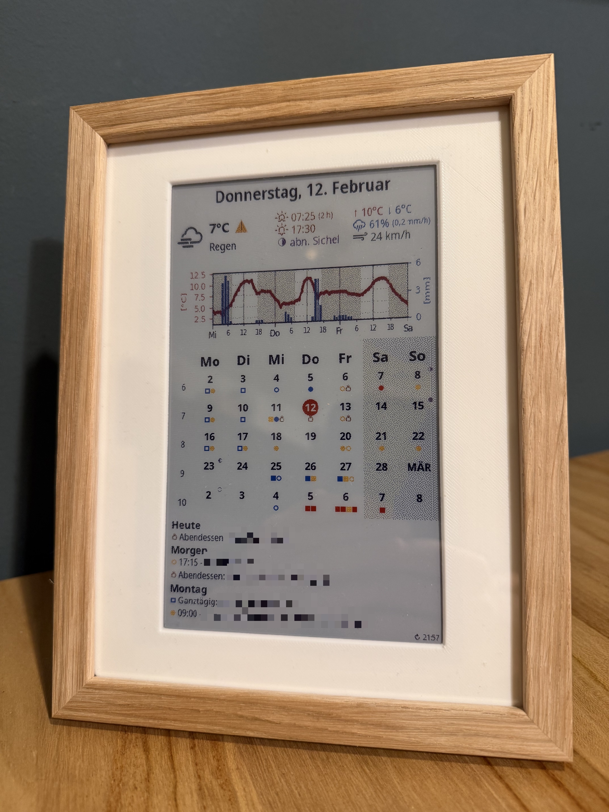

# Family E-Ink Statusboard and Photo Frame


An e-ink family statusboard for a 7.3" Spectra 6 panel.

I originally tested a immmich photo frame (EPF e-paper frame (https://github.com/jwchen119/EPF)), but my wife did not like photos on this e-ink display, so this project focuses on a practical statusboard view (weather, calendar, agenda, battery, and refresh info) while keeping the immmich function as a backup.

## What It Does

- Renders a full dashboard image for a 480x800 e-ink panel:
  - localized header/date
  - current weather summary
  - multi-day weather diagram (temperature + precipitation)
  - monthly calendar with event markers
  - agenda list with relative day labels
  - footer status (last refresh, battery)
- Supports two weather providers:
  - OpenWeatherMap (OWM)
  - Deutscher Wetterdienst (DWD, over BrightSky API)
- OWM mode requires an OpenWeatherMap API key. DWD mode works without an OWM key.
- In DWD mode, warning handling is sourced from DWD/BrightSky data.
- In DWD mode, sunrise/sunset default to local solar calculation (stable daily values) using the National Oceanic and Atmospheric Administration (NOAA) solar algorithm.
  - This is computed locally in code from latitude/longitude/date (no NOAA API/network call).
  - Optional setting: use OWM sunrise/sunset instead.
- DWD warnings can show multiple alert markers at once:
  - at most one marker per parameter (`min`, `max`, `precip`, `wind`)
  - plus one fallback marker next to current temperature when warnings are not classifiable
- Weather diagram supports automatic precipitation Y-axis scaling (default on), with optional manual max override.
- Weather diagram supports configurable time windows:
  - next N hours (default 72h)
  - optionally include already passed hours
- Weather summary scopes are configurable per metric (default: current day, matching Bright Sky demo behavior).
- Exposes HTTP endpoints for the frame and Home Assistant:
  - `/download`
  - `/battery` (GET/POST)
  - `/mode` (GET/POST)
  - `/sleep`
  - `/setting`

## How It Works

1. Flask serves a settings UI and API endpoints.
2. The frame requests `/download` and receives generated C-style pixel output (`image.c`).
3. Weather + calendar data are fetched server-side.
4. Rendering is done with Pillow + Matplotlib.
5. Configuration is persisted in `/config/config.yaml`.

## Calendar Marker Legend

- `●` round: event
- `○` round outline: recurring event
- `■` square: all-day event
- `□` square outline: recurring all-day event
- `pot icon`: meal event

## Bill of Materials (BOM)

| Qty | Part | Notes |
|---|---|---|
| 1x | [FireBeetle 2 ESP32-C6](https://www.dfrobot.com/product-2771.html) | no affiliate |
| 1x | [7.3-inch E Ink Spectra 6 (E6) Full Color E-Paper Display Module + HAT](https://www.waveshare.com/7.3inch-e-paper-hat-e.htm) | no affiliate |
| 1x | 3.7V LiPo battery, e.g. [EREMIT 4,000 mAh](https://www.eremit.de/p/eremit-3-7v-4-000mah-high-cap?cmdf=EREMIT+3.7V+4.000mAh+High+Cap.) | 4,000 mAh gives more capacity; does **not** fit the default CAD battery pocket |
| 1x | Button, e.g. [AliExpress example](https://a.aliexpress.com/_mqVMyRf) | this one is too large for the default print hole; hole had to be widened |
| 2x | Cables for button (e.g. Dupont) | short jumper wires |
| 2-4x | M3 screws, 8 mm (or shorter) | for HAT to 3D print |
| 4x | M4 screws, 14 mm (or shorter) | for upper panel to bottom panel |
| 1x set | 3D prints from EPF CAD (`bottom_panel.STEP`, `display_card.STEP`) | print `display_card` in white for passepartout effect |
| 1x | 6x8 inch frame (8x10 outer), e.g. [BGA Store](https://www.bgastore.de/rahmen-edsbyn-acrylglas-eiche-8x10-inches-20-32x25-4-cm) | 6x8 is less common in Germany |
| 1x | Soldering iron + glue | assembly |
| optional | USB-C magnetic cable | easier charging/access |

## Wiring (Top to Bottom on HAT)

> Check cable colors before soldering. Different cable sets may use different colors.

| HAT | Cable color | Pin |
|---|---|---|
| VCC | gray | 3V3 |
| GND | brown | GND |
| SCLK | yellow | 23 |
| DIN | blue | 22 |
| BUSY | violet | 18 |
| CS | orange | 1 |
| RST | white | 14 |
| DC | green | 8 |
| BTN | XX | other side, after installing button on 3D: GND |
| BTN | XX | other side, after installing button on 3D: 2 |

## Docker Compose

```yaml
services:
  frame-server:
    image: python:3.9-slim
    container_name: frame-server
    restart: unless-stopped
    ports:
      - "5000:5000"
    environment:
      - TZ=Europe/Berlin
      - OWM_API_KEY=your_openweathermap_key
      - IMMICH_API_KEY=your_immich_api_key
    volumes:
      - ./frame-server/app:/app
      - ./frame-server/config.yaml:/config/config.yaml
```

## Example `config.yaml`

```yaml
mode: statusboard

calendar:
  feeds:
    - name: Family
      url: https://example.com/family.ics
      color: yellow

weather:
  api_key: your_openweathermap_key
  provider: dwd   # dwd or owm
  latitude: 53.08
  longitude: 8.81
  temp_unit: celsius

statusboard:
  rotation: 0
  dither_strength: 0.8
  padding_left: 5
  padding_right: 5
  padding_top: 5
  padding_bottom: 0
  language: de
  show_current_temp: true
  show_suntime: true
  show_dwd_warnings: true
  dwd_use_owm_sun_times: false
  color_conditions: true
  summary_scope_temp: day
  summary_scope_precip_prob: day
  summary_scope_precip_rate: day
  summary_scope_wind: day
  summary_scope_sunshine: day
  max_precip_mm: 6.0
  diagram_auto_precip_max: true
  diagram_display_hours: 72
  diagram_include_past_hours: false
  diagram_locale: true
  diagram_night_shading: true
  diagram_hour_markers: true
  battery_show_below: 20
  month_label_first_day: true
  calendar_show_moon: true
  agenda_relative_days: 2
  agenda_weekday_format: dddd
  agenda_date_format: DD.MM.YYYY
  title_format: dddd, D. MMMM
  last_updated_format: HH:mm
  show_last_updated: true
  show_weather_fallback_info: true
  show_dwd_warning_near_value: true

display:
  mode: fill

immich:
  url: http://immich:2283
  album: YOUR_ALBUM_NAME
  rotation: 270
  enhanced: 1.5
  contrast: 1.0
  strength: 0.8
  display_mode: fill
  image_order: random
  sleep_start_hour: 23
  sleep_start_minute: 0
  sleep_end_hour: 6
  sleep_end_minute: 0
  wakeup_interval: 60
```

## Home Assistant Integration

### REST sensors

```yaml
sensor:
  - platform: rest
    name: epf_battery
    resource: http://YOUR_HOST:5000/battery
    value_template: "{{ value_json.percent | float(0) }}"
    unit_of_measurement: "%"
    scan_interval: 300

  - platform: rest
    name: epf_mode
    resource: http://YOUR_HOST:5000/mode
    value_template: "{{ value_json.mode }}"
    scan_interval: 30

  - platform: rest
    name: epf_next_update
    resource: http://YOUR_HOST:5000/sleep
    value_template: "{{ value_json.next_wakeup }}"
    scan_interval: 60
```

### Mode switch (`statusboard` / `immich`)

```yaml
rest_command:
  epf_set_mode:
    url: "http://YOUR_HOST:5000/mode"
    method: POST
    content_type: "application/json"
    payload: '{"mode":"{{ mode }}"}'

input_select:
  epf_display_mode:
    name: EPF Display Mode
    options:
      - statusboard
      - immich

automation:
  - alias: EPF Mode Sync
    trigger:
      - platform: state
        entity_id: input_select.epf_display_mode
    action:
      - service: rest_command.epf_set_mode
        data:
          mode: "{{ states('input_select.epf_display_mode') }}"
```

## Acknowledgements

Original Project:
- EPF Project (hardware/CAD/Arduino basis): [jwchen119/EPF](https://github.com/jwchen119/EPF)

Inspiration for Layout:
- MagInkCal: [speedyg0nz/MagInkCal](https://github.com/speedyg0nz/MagInkCal)
- Inkycal: [aceisace/Inkycal](https://github.com/aceisace/Inkycal)
- Bright Sky (DWD API wrapper): [jdemaeyer/brightsky](https://github.com/jdemaeyer/brightsky) and [API docs](https://brightsky.dev/docs/)

Font and Data:
- Weather icons/font: [erikflowers/weather-icons](https://github.com/erikflowers/weather-icons)
- Weather providers: [DWD](https://www.dwd.de/) and [OpenWeatherMap](https://openweathermap.org/)

## Built With Codex

This statusboard was vibe-coded with Codex (GPT-5).
